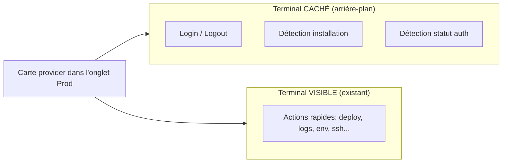
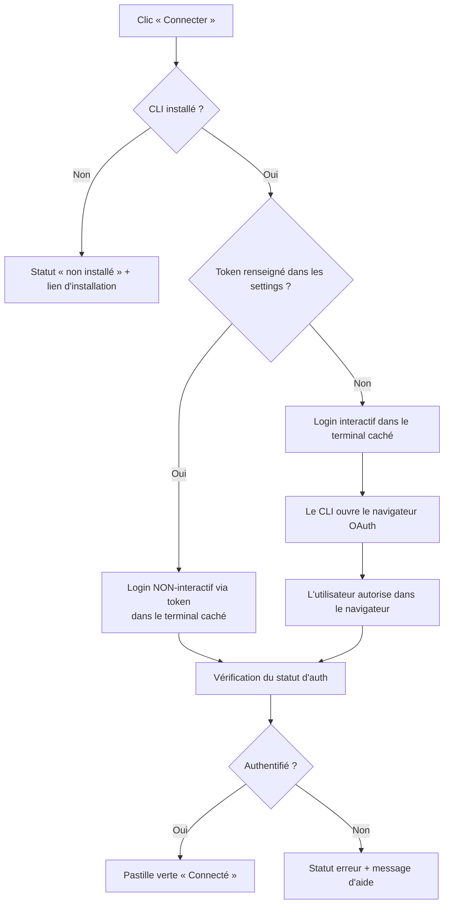
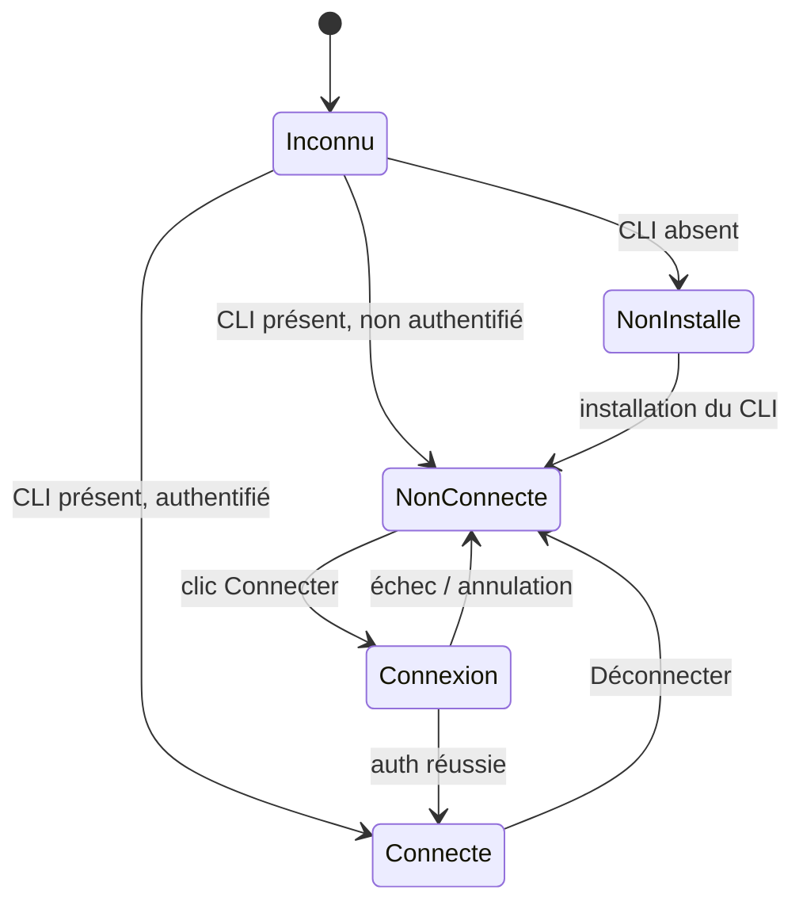
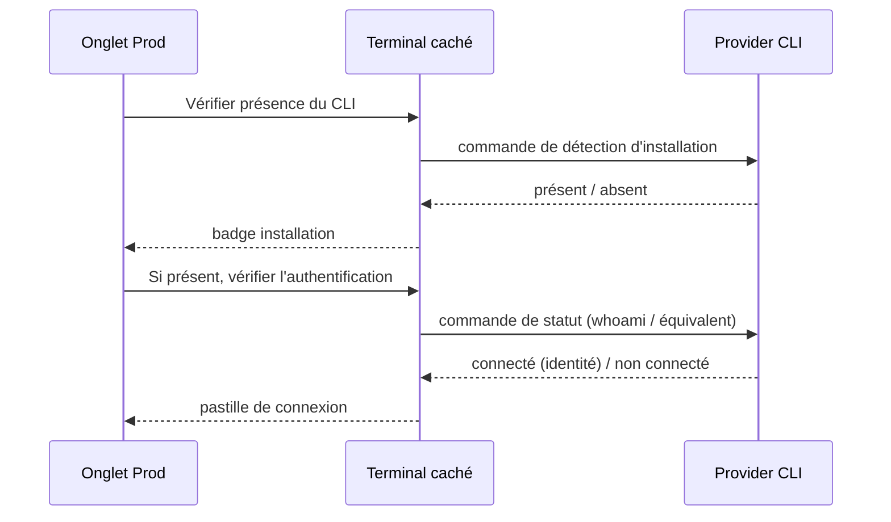

# FeatureProd.md — Plan de développement

> Onglet **« Prod »** dans les Settings : connexion en un clic aux providers de mise en production, via un **terminal de login caché** (arrière-plan), avec détection d'état et actions rapides.

---

## 1. Objectif

Ajouter dans le panneau Settings un nouvel onglet **Prod**, au même niveau que les onglets existants (Providers IA, Database, MCP, Skills, Sub-agents…). Cet onglet liste les outils de déploiement. Pour chaque provider :

- un bouton **Connecter** qui lance la commande de login **dans un terminal caché en arrière-plan**, sans saisie manuelle de l'utilisateur ;
- un **indicateur de statut** (CLI installé ? connecté ?) ;
- des **actions rapides** (deploy, logs, env…) qui envoient les commandes utiles dans le terminal.

L'onglet réutilise le pattern déjà éprouvé de l'onglet **Database** (section dédiée + persistance des réglages par domaine + bouton d'action de type « test connection »), et la capacité existante de l'app à faire tourner des sessions de terminal (sessions PTY déjà multi-instances côté terminal).

---

## 2. Décisions validées (cadrage)

| Sujet | Décision retenue |
|---|---|
| Base de code | `sinew-release-claake-1.21` (la plus récente) |
| Comportement du terminal de login | **Totalement caché** : on lance la commande, on s'appuie sur l'ouverture automatique du navigateur (OAuth), avec un simple indicateur de statut |
| Login par token | **Oui** quand le provider le permet (login non-interactif = le plus fiable pour un terminal caché) |
| Périmètre v1 | **Login + actions rapides** (deploy, logs, env…) envoyées dans le terminal |
| Détection automatique | **Les deux** : CLI installé (présence) **et** déjà connecté (statut/whoami → pastille verte) |
| Providers v1 | Sous-ensemble PaaS prioritaire : **Vercel, Railway, Netlify, Render, Fly.io, Heroku, Cloudflare (Wrangler), Supabase** — le reste en phase 2 |

---

## 3. Principe de fonctionnement

Deux contextes d'exécution distincts, c'est le point central de l'architecture :

- **Caché** = tout ce qui est court, global à la machine et non-interactif côté UI : le login (qui ouvre le navigateur pour l'OAuth, ou consomme un token), la détection d'installation, la vérification du statut d'authentification, la déconnexion.
- **Visible** = tout ce qui est long, contextuel au projet et potentiellement interactif : les actions de déploiement, les logs en flux, les commandes qui posent des questions. Ces commandes sont **injectées dans le terminal visible existant** (éventuellement une session dédiée par provider).

### Deux modes de connexion

- **Mode navigateur (OAuth)** : pour les providers qui ouvrent un navigateur (Vercel, Fly, Heroku, Cloudflare, Netlify, Supabase, Railway…). On lance, le navigateur s'ouvre, l'utilisateur autorise, le CLI finalise tout seul.
- **Mode token (non-interactif)** : un champ « token / clé API » dans les settings du provider permet un login totalement silencieux quand c'est possible. C'est aussi le **plan de secours** pour les CLI qui exigeraient une saisie au clavier (et qui ne fonctionneraient donc pas en terminal caché).

---

## 4. Expérience utilisateur (UI de l'onglet)

### Anatomie d'une carte provider

- Icône + nom du provider, et nom du CLI associé.
- **Badge d'installation** : installé / non installé (avec lien vers la doc d'installation si absent).
- **Pastille de connexion** : connecté (idéalement avec l'identité détectée) / non connecté / en cours.
- Bouton principal **Connecter** (ou **Déconnecter** si connecté).
- Champ optionnel **Token / clé API** (révélé au besoin), pour le login non-interactif.
- Rangée d'**actions rapides** (deploy, logs, env…), activées seulement si connecté.

### États possibles d'un provider

---

## 5. Détection automatique (à l'ouverture de l'onglet)

- Détection lancée à l'ouverture de l'onglet et après chaque action de connexion/déconnexion, avec un **bouton de rafraîchissement** manuel.
- Exécution **parallèle mais plafonnée** (éviter d'ouvrir trop de shells d'un coup).
- Détection **best-effort** : certains CLI n'ont pas de « whoami » propre → le statut peut rester « inconnu » sans bloquer l'usage.

---

## 6. Catalogue des providers

Le catalogue est la **donnée de référence** de la feature : pour chaque provider, son CLI, sa méthode de login, sa commande de vérification d'auth, la variable de token pour le mode non-interactif, et ses commandes utiles.

### Phase 1 (v1 — PaaS prioritaires)

| Provider | CLI | Login | Mode | Vérif. auth | Token (mode non-interactif) | Actions rapides |
|---|---|---|---|---|---|---|
| **Vercel** | `vercel` | `vercel login` | Navigateur / token | `vercel whoami` | `VERCEL_TOKEN` | `vercel`, `vercel --prod`, `vercel env`, `vercel logs` |
| **Railway** | `railway` | `railway login` (option sans navigateur) | Navigateur / token | `railway whoami` | `RAILWAY_TOKEN` | `railway init`, `railway link`, `railway up`, `railway logs` |
| **Netlify** | `netlify` | `netlify login` | Navigateur / token | `netlify status` | `NETLIFY_AUTH_TOKEN` | `netlify init`, `netlify deploy`, `netlify deploy --prod`, `netlify dev` |
| **Render** | `render` | `render login` | Navigateur / token | statut best-effort | `RENDER_API_KEY` | `render services`, `render deploys create`, `render logs`, `render ssh` |
| **Fly.io** | `fly` / `flyctl` | `fly auth login` | Navigateur / token | `fly auth whoami` | `FLY_API_TOKEN` | `fly launch`, `fly deploy`, `fly logs`, `fly ssh console` |
| **Heroku** | `heroku` | `heroku login` | Navigateur / token | `heroku auth:whoami` | `HEROKU_API_KEY` | `heroku create`, `git push heroku main`, `heroku logs --tail` |
| **Cloudflare** | `wrangler` | `wrangler login` | Navigateur / token | `wrangler whoami` | `CLOUDFLARE_API_TOKEN` | `wrangler dev`, `wrangler deploy`, `wrangler pages deploy` |
| **Supabase** | `supabase` | `supabase login` | Navigateur / token | `supabase projects list` | `SUPABASE_ACCESS_TOKEN` | `supabase init`, `supabase start`, `supabase db push`, `supabase functions deploy` |

### Phase 2 (le reste)

| Provider | CLI | Login | Mode | Particularité |
|---|---|---|---|---|
| **Firebase** | `firebase` | `firebase login` | Navigateur | Actions : `init`, `deploy`, `emulators:start` |
| **Koyeb** | `koyeb` | `koyeb login` | Token | Actions : `deploy`, `apps`, `services`, `service logs` |
| **Qovery** | `qovery` | `qovery auth` | Navigateur | Actions : `deploy`, `shell`, `logs`, `context` |
| **DigitalOcean** | `doctl` | `doctl auth init` | **Token (saisie)** | Idéal pour le champ token ; vérif. via `doctl account get` |
| **AWS Amplify** | `amplify` | `amplify configure` | Interactif/console | Peu compatible « caché » → token/profil AWS conseillé |
| **Google Cloud** | `gcloud` | `gcloud auth login` | Navigateur | Vérif. via `gcloud auth list` |
| **Azure** | `az` | `az login` | Navigateur | Vérif. via `az account show` |
| **Hugging Face** | `hf` | `hf auth login` | **Token** | `HF_TOKEN` ; utile Spaces/ML |
| **Docker Hub** | `docker` | `docker login` | **User/Pass ou token** | Peu compatible « caché » sans token |
| **Pulumi** | `pulumi` | `pulumi login` | Navigateur / token | Vérif. via `pulumi whoami` ; `PULUMI_ACCESS_TOKEN` |
| **Terraform Cloud** | `terraform` | `terraform login` | Navigateur / token | Token `TF_TOKEN_app_terraform_io` |

> Note : les providers marqués « token » ou « interactif » confirment l'intérêt du champ token comme mécanisme principal ou de secours pour rester en mode caché.

---

## 7. Persistance & modèle de données (conceptuel)

- Réutiliser le **mécanisme de sauvegarde de réglages par domaine** déjà en place pour les autres onglets (chaque domaine de settings a sa propre sauvegarde persistée côté application).
- Pour chaque provider, on persiste : un identifiant de provider, le token éventuel, et un éventuel cache léger du dernier statut connu.
- L'**état réel de connexion n'est jamais déduit du stockage** : il est toujours re-vérifié via la commande de statut (source de vérité = le CLI lui-même), le cache ne servant qu'à l'affichage immédiat.

---

## 8. Sécurité

- Les tokens sont des secrets : les traiter **au moins aussi sérieusement que les identifiants de base de données** déjà gérés par l'app, idéalement via le **trousseau/coffre du système d'exploitation** plutôt qu'en clair.
- Masquage à l'affichage (champ secret, jamais réaffiché en clair une fois saisi).
- Ne **jamais** écrire les tokens dans le terminal **visible** ni dans des logs : le passage du token au CLI se fait uniquement dans le **terminal caché**, via variable d'environnement de session.
- Actions destructrices (ex. `destroy`, déploiement en prod) : **confirmation explicite** avant injection dans le terminal.

---

## 9. Découpage en features

| # | Feature | Description | Dépend de | Complexité |
|---|---|---|---|---|
| F1 | **Catalogue de providers** | Définition de référence (CLI, login, mode, vérif. auth, token, actions) pour les 8 providers v1 | — | Simple |
| F2 | **Onglet Prod** | Nouvel onglet dans la navigation des Settings + zone de contenu | F1 | Simple |
| F3 | **Carte provider** | Affichage statut, boutons, champ token, actions rapides | F2 | Moyen |
| F4 | **Terminal caché** | Session PTY d'arrière-plan dédiée au login/détection (création à la demande, fin de vie après usage, statut « en cours ») | — | Moyen |
| F5 | **Détection installation + auth** | Lancement des vérifications, parallélisme plafonné, badges, rafraîchissement | F1, F4 | Moyen |
| F6 | **Connexion OAuth** | Clic Connecter → login navigateur en caché → re-vérification du statut | F4, F5 | Moyen |
| F7 | **Connexion par token** | Champ token + login non-interactif silencieux | F3, F4 | Moyen |
| F8 | **Déconnexion** | Logout du provider en caché + mise à jour du statut | F4, F5 | Simple |
| F9 | **Actions rapides** | Injection des commandes utiles dans le terminal **visible** (session dédiée optionnelle, confirmation si destructeur) | F2, F3 | Moyen |
| F10 | **Persistance** | Sauvegarde des réglages providers selon le pattern existant | F1 | Moyen |
| F11 | **Sécurité des tokens** | Stockage protégé + masquage + non-fuite dans les logs/terminal visible | F7, F10 | Moyen |
| F12 | **Phase 2 providers** | Extension du catalogue aux 11 providers restants | F1–F11 | Évolutif |

---

## 10. Phasage

- **v1** : F1 → F11 sur les 8 providers PaaS (Vercel, Railway, Netlify, Render, Fly, Heroku, Cloudflare, Supabase).
- **Phase 2** : F12 — ajout des providers restants, en réutilisant exactement le même socle.

---

## 11. Points ouverts & risques

- **Détection d'auth hétérogène** : tous les CLI n'offrent pas de « whoami » fiable → statut « inconnu » possible, sans bloquer l'usage.
- **Logins non-headless** (Docker sans token, Amplify…) : incompatibles avec un terminal 100 % caché → **mitigation = champ token**, et à défaut, révélation ponctuelle du terminal visible comme solution de repli (à valider si on veut l'ajouter).
- **Nommage CLI variable** (`fly`/`flyctl`) et **installation multi-OS** (macOS/Linux/Windows) : en v1, on se limite à signaler l'absence + lien doc, l'installation automatique étant un sujet à part.
- **Actions interactives** (premiers `init`/`launch`) : doivent passer par le terminal **visible**, jamais le caché.
- **Sécurité des secrets** : choix exact du stockage (coffre OS vs réglages applicatifs) à arbitrer en début d'implémentation.
